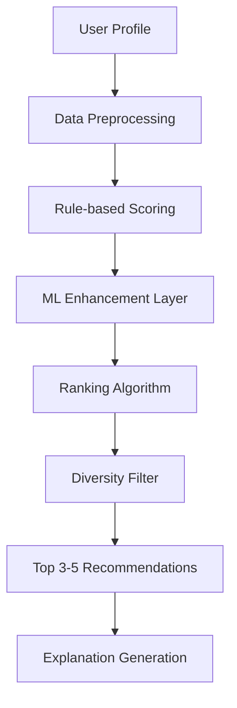

# AI-Based Internship Recommendation Engine for PM Internship Scheme

**Version:** 1.0  
**Date:** September 2024  
**Tech Stack:** Node.js (Express.js backend) + React/TypeScript frontend  
**Document Owner:** Product Team  

---

## 1. Executive Summary

### 1.1 Product Vision
To democratize internship discovery for Indian youth by providing an AI-powered recommendation engine that matches applicants with the most relevant opportunities, with special focus on first-generation learners and digitally underserved communities.

### 1.2 Product Title
**AI-Based Internship Recommendation Engine for PM Internship Scheme**

### 1.3 Product Description
A lightweight, mobile-first web application integrated with the PM Internship Scheme portal that delivers 3-5 personalized internship recommendations to each applicant. The system leverages user profile data, skills, and interests to provide intelligent matching, specifically designed for youth aged 21-24 from diverse Indian backgrounds, including rural and low-digital-literacy users.

### 1.4 Key Value Propositions
- **Personalized Discovery:** AI-driven matching reduces information overload
- **Inclusive Design:** Multilingual, mobile-first interface for digital inclusion
- **Quality Matching:** Improves application relevance for both applicants and employers
- **Seamless Integration:** Embeddable widget for existing PMIS portal

---

## 2. Stakeholder Analysis

| Stakeholder Group | Role | Key Interests | Success Criteria |
|-------------------|------|---------------|------------------|
| **End Users** | Youth applicants (21-24 years) | Find relevant internships easily | >60% apply to recommended internships |
| **Ministry of Corporate Affairs** | Product Owner | Successful scheme implementation | High user engagement, positive feedback |
| **Partner Companies** | Internship Providers | Quality candidate applications | Better application-role fit |
| **Internal Teams** | Development, QA, DevOps, Design | Successful product delivery | On-time, quality delivery |

### 2.1 Target Platforms & Compatibility

| Platform | Specification | Priority |
|----------|---------------|----------|
| **Device Support** | Mobile-first responsive web (PWA principles) | High |
| **Browser Compatibility** | Chrome, Firefox, Edge, Safari, Android WebView | High |
| **Integration** | Embeddable widget/iframe for PMIS portal | High |
| **Offline Support** | Basic offline messaging and caching | Medium |

## 3. Problem Statement & Market Opportunity

### 3.1 Current Challenges

#### For Applicants:
- **Information Overload:** Hundreds of internship listings overwhelm users, especially those with limited digital experience
- **Poor Matching:** Difficulty in identifying relevant opportunities based on skills and academic background
- **Digital Divide:** Complex interfaces exclude first-generation learners and rural applicants
- **Language Barriers:** English-only content limits accessibility for vernacular language users

#### For Employers:
- **Low-Quality Applications:** High volume of irrelevant applications
- **Skill Mismatch:** Difficulty finding candidates with appropriate skill sets
- **Inefficient Screening:** Time-intensive manual filtering process

### 3.2 Market Opportunity
- **Target Market Size:** 50+ million youth aged 21-24 in India
- **Underserved Segments:** 70% of target users are first-generation learners or from rural backgrounds
- **Government Initiative:** PM Internship Scheme aims to provide 1 crore internships

---

## 4. Objectives & Success Metrics

### 4.1 Primary Objectives

| Objective | Description | Target Outcome |
|-----------|-------------|----------------|
| **Simplify Discovery** | Make internship discovery intuitive and personalized | 3-step user journey max |
| **Improve Matching** | Enhance application-role fit quality | 75% relevance accuracy |
| **Enable Inclusion** | Support users with low digital literacy | 80% mobile engagement |
| **Ensure Performance** | Deliver fast, reliable recommendations | <2 seconds response time |

### 4.2 Key Performance Indicators (KPIs)

#### User Engagement Metrics
- **Application Rate:** 60% of users apply to at least one recommended internship
- **Completion Rate:** 85% of users complete the profile input flow
- **Return Usage:** 40% of users return within 7 days
- **Mobile Usage:** 80% of interactions on mobile devices

#### Quality Metrics
- **Relevance Score:** 75% accuracy in user feedback on recommendations
- **Match Quality:** 70% of applications result in interview invitations
- **User Satisfaction:** 4.2+ rating on recommendation usefulness

#### Technical Metrics
- **Response Time:** <2 seconds for recommendation generation (95th percentile)
- **Uptime:** 99.5% system availability
- **Load Capacity:** Support 10,000+ concurrent users

#### Inclusion Metrics
- **Language Distribution:** Track Hindi vs English usage patterns
- **Geographic Reach:** Measure rural vs urban user adoption
- **Accessibility Compliance:** 100% WCAG 2.1 AA compliance

## 5. User Personas & Journey Mapping

### 5.1 Primary Personas

#### Persona 1: Priya - Rural First-Generation Learner
| Attribute | Details |
|-----------|---------|
| **Demographics** | Age 22, B.Com graduate, Rural Haryana |
| **Background** | First in family to pursue higher education, limited tech exposure |
| **Digital Literacy** | Basic smartphone usage, comfortable with WhatsApp/social media |
| **Language** | Primarily Hindi, basic English comprehension |
| **Goals** | Find internship in banking/finance, gain work experience |
| **Pain Points** | Overwhelmed by options, unfamiliar with corporate terminology |
| **Motivations** | Financial independence, family pride, career growth |

#### Persona 2: Ravi - Urban Skilled Worker
| Attribute | Details |
|-----------|---------|
| **Demographics** | Age 24, Diploma in Mechanical Engineering, Urban slum, Mumbai |
| **Background** | Practical skills focus, no prior internship experience |
| **Digital Literacy** | Good with apps, prefers visual interfaces |
| **Language** | Hindi preferred, limited English proficiency |
| **Goals** | Manufacturing/automotive internship, hands-on experience |
| **Pain Points** | Complex application processes, English-heavy content |
| **Motivations** | Skill validation, better job prospects, family support |

#### Persona 3: Neha - Tribal Area Graduate
| Attribute | Details |
|-----------|---------|
| **Demographics** | Age 21, B.Sc. in Biology, Tribal area, Jharkhand |
| **Background** | First-generation college student, uncertain about career paths |
| **Digital Literacy** | Average app usage, learns quickly |
| **Language** | Bilingual (Hindi/English), regional language at home |
| **Goals** | Healthcare/research internship, explore career options |
| **Pain Points** | Limited career awareness, geographic constraints |
| **Motivations** | Community impact, personal growth, breaking barriers |

### 5.2 User Stories & Acceptance Criteria

#### Epic 1: Profile Creation & Onboarding
| User Story | Acceptance Criteria |
|------------|-------------------|
| **As Priya**, I want to create my profile using simple Hindi instructions, so I can understand each step clearly | • Hindi language option available<br>• Visual icons for each field<br>• Tooltips explain technical terms<br>• Progress indicator shows completion |
| **As Ravi**, I want to select my skills using pictures and icons, so I don't struggle with English descriptions | • Visual skill selector with icons<br>• Hover/tap descriptions in Hindi<br>• Multiple selection capability<br>• Auto-suggest based on education |

#### Epic 2: Recommendation Discovery
| User Story | Acceptance Criteria |
|------------|-------------------|
| **As Neha**, I want to see internships ranked by location proximity, so I can find opportunities I can actually pursue | • Location-based filtering<br>• Distance display in km<br>• Transport connectivity info<br>• Remote work options highlighted |
| **As Priya**, I want to understand why each internship was recommended, so I can make informed decisions | • "Why recommended" explanation<br>• Skill match percentage<br>• Education relevance score<br>• Clear benefit statements |

#### Epic 3: Application Process
| User Story | Acceptance Criteria |
|------------|-------------------|
| **As Ravi**, I want to apply to internships with minimal steps, so the process doesn't overwhelm me | • One-click apply from recommendations<br>• Pre-filled application forms<br>• Progress saving capability<br>• Confirmation messaging |

## 6. Feature Requirements & Specifications

### 6.1 User Profile Input System

#### Core Profile Fields
| Field | Type | Validation | Priority |
|-------|------|------------|----------|
| **Education Level** | Dropdown | Min 10th pass required | High |
| **Specialization/Stream** | Conditional dropdown | Based on education level | High |
| **Skills** | Multi-select with typeahead | Visual icons + text | High |
| **Interest Sectors** | Multi-select with icons | Max 3 selections | High |
| **Location** | Auto-detect + manual fallback | State/District/City | High |
| **Language Preference** | Radio buttons | Hindi/English/Others | High |
| **Experience** | Optional text area | Previous internships/work | Medium |
| **Accessibility Needs** | Optional checkboxes | Screen reader, mobility | Medium |

#### User Experience Features
- **Progressive Form:** Single-page with smooth scrolling sections
- **Smart Defaults:** Pre-populate based on education selection
- **Visual Aids:** Icons for skills, sectors, and common terms
- **Input Validation:** Real-time feedback with helpful error messages
- **Save Progress:** Auto-save every 30 seconds, resume capability

### 6.2 AI Recommendation Engine

#### Scoring Algorithm Components

| Component | Weight | Description | Implementation |
|-----------|--------|-------------|----------------|
| **Education Match** | 35% | Direct degree/diploma alignment | Rule-based mapping |
| **Skills Overlap** | 25% | Keyword matching + semantic similarity | TF-IDF + fuzzy matching |
| **Sector Interest** | 20% | User-selected industry preferences | Direct matching |
| **Location Proximity** | 15% | Distance-based scoring | Haversine formula |
| **Company Inclusivity** | 5% | Diversity-friendly employers | Manual tagging |

#### Recommendation Logic Flow
1. **Filtering:** Remove ineligible internships (education, location constraints)
2. **Scoring:** Apply weighted algorithm to remaining opportunities
3. **Ranking:** Sort by composite score, apply diversity filters
4. **Selection:** Pick top 3-5 with explanation generation
5. **Personalization:** Adjust based on user feedback history

#### Machine Learning Extensibility
- **Phase 1:** Rule-based system with manual tuning
- **Phase 2:** Logistic regression for score optimization
- **Phase 3:** Collaborative filtering for similar user patterns
- **Future:** Deep learning for complex pattern recognition

## 5.3 User Interface (UI/UX)
Homepage: PMIS branding, educational visuals

Input: Big buttons, icons, regional language text, auto-complete, progressive form

Results: 3-5 internships as cards (each shows: internship name, company, stipend, location, fit meter, brief description, “Apply” button)

Language toggle: Hindi/English, extensible for other Indian languages

Accessibility: Large touch targets, screen-reader support, color contrast, tooltips

### 6.4 Mobile-First Design Requirements

#### Performance Optimization
| Metric | Target | Implementation |
|--------|--------|----------------|
| **Page Load Time** | <2 seconds | Image compression, lazy loading, CDN |
| **Bundle Size** | <500KB initial | Code splitting, tree shaking |
| **Offline Support** | Basic functionality | Service worker, cached responses |
| **Network Tolerance** | Works on 2G | Progressive enhancement, skeleton screens |

#### Touch Interface Design
- **Minimum Touch Target:** 44px x 44px (iOS/Android guidelines)
- **Gesture Support:** Swipe navigation, pull-to-refresh
- **Thumb-Friendly Layout:** Important actions within thumb reach
- **Haptic Feedback:** Confirmation for key actions

### 6.5 Integration Architecture

#### PMIS Portal Integration
| Integration Type | Implementation | Benefits |
|------------------|----------------|----------|
| **Iframe Embed** | Responsive iframe with postMessage API | Quick deployment, isolated environment |
| **Widget Integration** | JavaScript SDK with CSS injection | Better UX, shared authentication |
| **API Integration** | RESTful endpoints for recommendation data | Maximum flexibility, custom UI |

#### API Specifications
```
POST /api/v1/recommendations
Content-Type: application/json

Request:
{
  "userId": "string",
  "profile": {
    "education": "string",
    "skills": ["string"],
    "location": {"state": "string", "district": "string"},
    "interests": ["string"],
    "language": "string"
  }
}

Response:
{
  "recommendations": [
    {
      "id": "string",
      "title": "string",
      "company": "string",
      "location": "string",
      "stipend": "number",
      "matchScore": "number",
      "explanation": "string",
      "applyUrl": "string"
    }
  ],
  "metadata": {
    "totalCount": "number",
    "processingTime": "number"
  }
}
```

---

## 7. Non-Functional Requirements

### 7.1 Performance Requirements
| Metric | Target | Measurement |
|--------|--------|-------------|
| **Response Time** | <2 seconds (95th percentile) | Server-side recommendation generation |
| **Page Load** | <3 seconds | First contentful paint |
| **Throughput** | 1000 requests/second | Peak load capacity |
| **Availability** | 99.5% uptime | Monthly SLA |

### 7.2 Security & Privacy
| Requirement | Implementation | Compliance |
|-------------|----------------|------------|
| **Data Encryption** | HTTPS/TLS 1.3, encrypted storage | IT Act 2000 |
| **Input Validation** | Server-side sanitization, parameterized queries | OWASP Top 10 |
| **Authentication** | OAuth 2.0 integration with PMIS | Government standards |
| **Privacy Protection** | Data minimization, consent management | Digital Personal Data Protection Act |

### 7.3 Scalability & Reliability
- **Concurrent Users:** Support 10,000+ during peak government drives
- **Database Scaling:** Horizontal scaling with read replicas
- **CDN Integration:** Global content delivery for static assets
- **Auto-scaling:** Container orchestration with load balancing

### 7.4 Localization & Accessibility
| Feature | Specification | Standard |
|---------|---------------|----------|
| **Language Support** | Hindi, English at launch; extensible framework | Unicode UTF-8 |
| **RTL Support** | Right-to-left text rendering capability | CSS Logical Properties |
| **Screen Reader** | Full compatibility with JAWS, NVDA | WCAG 2.1 AA |
| **Keyboard Navigation** | Complete functionality without mouse | Section 508 |
| **Color Contrast** | 4.5:1 minimum ratio | WCAG 2.1 AA |

### 7.5 Maintainability
- **Code Quality:** TypeScript, ESLint, Prettier, 80%+ test coverage
- **Documentation:** API docs, deployment guides, troubleshooting
- **Monitoring:** Application performance monitoring, error tracking
- **Admin Tools:** Content management, user analytics, manual overrides

---

## 8. Technical Architecture

### 8.1 Frontend Technology Stack

| Component | Technology Choice | Rationale |
|-----------|------------------|----------|
| **Framework** | React 18 + TypeScript | Strong ecosystem, government project compatibility |
| **UI Library** | Chakra UI + Custom Components | RTL support, accessibility features, customizable |
| **State Management** | React Context + Zustand | Lightweight, suitable for app complexity |
| **Form Handling** | React Hook Form | Performance optimized, minimal re-renders |
| **Build Tool** | Vite | Fast development, optimized production builds |
| **Internationalization** | react-i18next | Robust i18n support, namespace organization |
| **Styling** | Emotion + Tailwind CSS | Utility-first approach, responsive design |
| **Testing** | Jest + React Testing Library | Component testing, accessibility testing |

### 8.2 Backend Architecture

| Component | Technology | Purpose |
|-----------|------------|----------|
| **Runtime** | Node.js 18+ LTS | JavaScript ecosystem, rapid development |
| **Framework** | Express.js + Helmet | RESTful APIs, security middleware |
| **Database** | PostgreSQL + MongoDB | Structured data + flexible document storage |
| **Caching** | Redis | Session storage, recommendation caching |
| **Search** | Elasticsearch (optional) | Advanced internship search capabilities |
| **Message Queue** | Bull Queue + Redis | Background job processing |

### 8.3 Recommendation Engine Architecture



#### Core Components
- **Profile Processor:** Normalizes and validates user input
- **Scoring Engine:** Applies weighted algorithm for relevance
- **ML Layer:** Optional enhancement for pattern recognition
- **Explainability Module:** Generates "why recommended" text

### 8.4 DevOps & Infrastructure

| Component | Technology | Configuration |
|-----------|------------|---------------|
| **Containerization** | Docker + Docker Compose | Multi-stage builds, optimized images |
| **Orchestration** | Kubernetes (optional) | Auto-scaling, load balancing |
| **CI/CD** | GitHub Actions | Automated testing, deployment |
| **Cloud Platform** | AWS/Azure/GCP | Government cloud compliance |
| **CDN** | CloudFront/Azure CDN | Static asset delivery |
| **Monitoring** | Prometheus + Grafana | Metrics collection, dashboards |
| **Logging** | ELK Stack (Elasticsearch, Logstash, Kibana) | Centralized logging, analysis |
| **Error Tracking** | Sentry | Real-time error monitoring |

### 8.5 Security Architecture

#### Authentication & Authorization
- **SSO Integration:** SAML 2.0 with PMIS portal
- **API Security:** JWT tokens, rate limiting
- **Data Encryption:** AES-256 at rest, TLS 1.3 in transit

#### Compliance Framework
- **Data Privacy:** GDPR-inspired practices, consent management
- **Government Standards:** Compliance with IT Act 2000
- **Security Auditing:** Regular penetration testing, vulnerability scans

---

## 9. Cross-Functional Features

### 9.1 Admin Dashboard

| Feature | Description | User Role |
|---------|-------------|----------|
| **Content Management** | Add/edit/remove internship listings | Content Admin |
| **User Analytics** | View user engagement, application rates | Analytics Admin |
| **System Monitoring** | Performance metrics, error rates | Technical Admin |
| **Manual Overrides** | Adjust recommendations for edge cases | Super Admin |
| **Bulk Operations** | Import/export internship data | Data Admin |
| **Feedback Analysis** | Review user feedback, improve algorithm | Product Admin |

### 9.2 Feedback & Learning System

#### User Feedback Collection
- **Relevance Rating:** 1-5 star rating for each recommendation
- **Application Tracking:** Monitor which recommendations lead to applications
- **Qualitative Feedback:** Optional text feedback for improvements
- **Usage Analytics:** Track user journey, drop-off points

#### Continuous Improvement Loop
1. **Data Collection:** Gather user interactions and feedback
2. **Analysis:** Identify patterns in successful/unsuccessful matches
3. **Algorithm Tuning:** Adjust scoring weights based on feedback
4. **A/B Testing:** Test algorithm improvements with user segments
5. **Deployment:** Roll out improvements incrementally

### 9.3 Notification System

| Channel | Use Case | Frequency |
|---------|----------|----------|
| **In-App Notifications** | New recommendations, application status | Real-time |
| **Email** | Weekly digest, important updates | Weekly |
| **SMS** | Critical notifications (optional) | As needed |
| **Push Notifications** | Re-engagement, new opportunities | Controlled |

---

## 10. Competitive Analysis & Market Positioning

### 10.1 Competitive Landscape

| Competitor | Strengths | Weaknesses | Differentiation |
|------------|-----------|------------|-----------------|
| **Naukri.com** | Large database, brand recognition | Complex interface, not internship-focused | Government backing, inclusion focus |
| **Internshala** | Internship specialization, good UX | Limited rural reach, English-heavy | Multilingual, rural accessibility |
| **LinkedIn** | Professional network, recommendations | High digital literacy requirement | Simplified interface, local language |
| **AngelList** | Startup focus, quality curation | Limited to tech sector | Broader sector coverage, government support |

### 10.2 Unique Value Proposition
- **Government Integration:** Seamless PMIS portal integration
- **Inclusion-First Design:** Built for first-generation learners and rural users
- **AI-Powered Matching:** Personalized recommendations vs. generic search
- **Multilingual Support:** Hindi and regional language accessibility
- **Quality Assurance:** Government-verified internship opportunities

---

## 11. Risk Assessment & Mitigation

### 11.1 Technical Risks

| Risk | Probability | Impact | Mitigation Strategy |
|------|-------------|--------|-------------------|
| **Integration Challenges** | Medium | High | Early PMIS API testing, fallback options |
| **Performance Issues** | Low | High | Load testing, CDN implementation, caching |
| **Security Vulnerabilities** | Medium | High | Security audits, penetration testing |
| **Data Quality Issues** | High | Medium | Data validation, manual review processes |

### 11.2 Business Risks

| Risk | Probability | Impact | Mitigation Strategy |
|------|-------------|--------|-------------------|
| **Low User Adoption** | Medium | High | User testing, marketing campaign, training |
| **Poor Recommendation Quality** | Medium | High | Continuous feedback loop, algorithm tuning |
| **Scalability Challenges** | Low | Medium | Cloud infrastructure, auto-scaling |
| **Regulatory Changes** | Low | High | Legal compliance monitoring, flexible architecture |

### 11.3 Operational Risks

| Risk | Probability | Impact | Mitigation Strategy |
|------|-------------|--------|-------------------|
| **Team Capacity** | Medium | Medium | Cross-training, documentation, external support |
| **Timeline Delays** | Medium | Medium | Agile methodology, MVP approach, buffer time |
| **Budget Overruns** | Low | Medium | Regular budget reviews, scope management |

---

## 12. Implementation Roadmap

### 12.1 Development Phases

#### Phase 1: Foundation (Weeks 1-2)
- [ ] Requirements finalization and stakeholder alignment
- [ ] Technical architecture setup and environment configuration
- [ ] UI/UX wireframes and design system creation
- [ ] Database schema design and API specification
- [ ] Development team onboarding and tool setup

#### Phase 2: Core Development (Weeks 3-4)
- [ ] User profile input system implementation
- [ ] Basic recommendation engine (rule-based) development
- [ ] Frontend components and responsive design
- [ ] API development and integration testing
- [ ] Multilingual content setup (Hindi/English)

#### Phase 3: Integration & Enhancement (Week 5)
- [ ] PMIS portal integration and authentication
- [ ] Admin dashboard development
- [ ] Feedback system implementation
- [ ] Performance optimization and caching
- [ ] Security implementation and testing

#### Phase 4: Testing & Launch (Week 6)
- [ ] User acceptance testing with target personas
- [ ] Accessibility testing and WCAG compliance
- [ ] Load testing and performance validation
- [ ] Security audit and penetration testing
- [ ] Production deployment and monitoring setup

### 12.2 Success Criteria by Phase

| Phase | Key Deliverables | Success Metrics |
|-------|------------------|-----------------|
| **Phase 1** | Architecture, wireframes, setup | 100% team readiness, approved designs |
| **Phase 2** | Working MVP, basic features | Core functionality operational |
| **Phase 3** | Integrated system, admin tools | PMIS integration successful |
| **Phase 4** | Production-ready system | Performance targets met, UAT passed |

---

## 13. Assumptions & Dependencies

### 13.1 Technical Assumptions
- PMIS portal supports iframe embedding or widget integration
- Internship data is available via secure APIs or bulk import
- Government cloud infrastructure meets performance requirements
- Third-party services (Redis, CDN) are accessible and reliable

### 13.2 Business Assumptions
- Target users have basic smartphone literacy
- Government marketing support for user acquisition
- Partner companies will provide quality internship data
- Regulatory environment remains stable during development

### 13.3 External Dependencies
- PMIS portal development team coordination
- Ministry approval for design and content
- Legal clearance for data privacy compliance
- Infrastructure provisioning and security clearances

---

## 14. Out of Scope (Current Version)

### 14.1 Advanced Features (Future Roadmap)
- Complex ML/AI (deep learning, LLM-driven conversations)
- Real-time collaborative filtering at scale
- Advanced analytics and predictive modeling
- Integration with external job portals

### 14.2 Extended Functionality
- Payment processing or stipend management
- Interview scheduling and video conferencing
- Comprehensive employer management panel
- Standalone mobile application development
- Real-time chat support system

### 14.3 Advanced Integrations
- WhatsApp/SMS notification system
- Social media integration and sharing
- Advanced geolocation and mapping features
- Integration with educational institution systems

---

## 15. UI/UX Design Specifications

### 15.1 Wireframe Requirements

#### Homepage Design
- **Hero Section:** PMIS branding with clear value proposition
- **Call-to-Action:** Prominent "Find My Internships" button
- **Language Toggle:** Visible Hindi/English switcher
- **Trust Indicators:** Government logos, security badges

#### Profile Input Form
- **Single Page Layout:** Progressive disclosure with smooth scrolling
- **Visual Elements:** Large icons for skills and sectors
- **Input Fields:** Touch-friendly with 44px minimum target size
- **Progress Indicator:** Clear completion status
- **Accessibility Features:** Screen reader support, high contrast mode

#### Results Screen
- **Card Layout:** 3-5 internship cards with visual hierarchy
- **Information Display:** Company logo, stipend, location, match score
- **Explanation Panel:** "Why recommended" with clear reasoning
- **Action Buttons:** Apply, Save, Feedback options
- **Filter Options:** Location, sector, stipend range

### 15.2 Design System Components

| Component | Specifications | Accessibility |
|-----------|----------------|---------------|
| **Buttons** | Min 44px height, rounded corners, clear labels | Focus indicators, keyboard navigation |
| **Cards** | Shadow elevation, consistent spacing, responsive | Semantic HTML, ARIA labels |
| **Forms** | Large touch targets, clear validation | Error announcements, field descriptions |
| **Icons** | 24px minimum, consistent style, meaningful | Alt text, descriptive tooltips |

---

## 16. Testing Strategy

### 16.1 Testing Approach

| Testing Type | Coverage | Tools | Timeline |
|--------------|----------|-------|----------|
| **Unit Testing** | 80%+ code coverage | Jest, React Testing Library | Ongoing |
| **Integration Testing** | API endpoints, database | Supertest, MongoDB Memory Server | Week 4-5 |
| **E2E Testing** | Critical user journeys | Playwright, Cypress | Week 5-6 |
| **Accessibility Testing** | WCAG 2.1 AA compliance | axe-core, WAVE | Week 5-6 |
| **Performance Testing** | Load, stress, scalability | Artillery, K6 | Week 6 |
| **Security Testing** | Vulnerability assessment | OWASP ZAP, SonarQube | Week 6 |

### 16.2 User Acceptance Testing

#### Test Scenarios
- **Persona-based Testing:** Test with representative users from each persona
- **Device Testing:** iOS/Android smartphones, tablets, desktop browsers
- **Network Testing:** 2G/3G/4G connectivity simulation
- **Language Testing:** Hindi and English interface validation

#### Success Criteria
- 90% task completion rate for core user journeys
- <3 seconds average task completion time
- 4.0+ user satisfaction rating
- Zero critical accessibility violations

---

## 17. Glossary

| Term | Definition |
|------|------------|
| **Fit Meter** | Visual progress bar showing profile-internship alignment score (0-100%) |
| **Rule-based Matching** | Non-ML algorithm using predefined criteria and weighted scoring |
| **Collaborative Hints** | Recommendations influenced by similar user behavior patterns |
| **Progressive Disclosure** | UI pattern revealing information gradually to reduce cognitive load |
| **PMIS** | Prime Minister's Internship Scheme - government internship program |
| **First-generation Learner** | Students who are first in their family to pursue higher education |
| **Digital Literacy** | Basic skills needed to use digital devices and internet services |
| **Vernacular Language** | Local or regional language spoken by specific communities |
| **Inclusive Design** | Design approach ensuring accessibility for users with diverse abilities |
| **PWA** | Progressive Web App - web application with native app-like features |

---

## 18. Success Metrics & Evaluation Framework

### 18.1 Launch Metrics (First 30 Days)

| Metric | Target | Measurement Method |
|--------|--------|--------------------|
| **User Registration** | 10,000+ users | Analytics tracking |
| **Profile Completion** | 85% completion rate | Funnel analysis |
| **Recommendation Usage** | 70% view recommendations | User journey tracking |
| **Application Rate** | 60% apply to ≥1 recommendation | Conversion tracking |
| **User Satisfaction** | 4.2+ rating | In-app feedback surveys |

### 18.2 Long-term Success Indicators (3-6 Months)

| Metric | Target | Business Impact |
|--------|--------|-----------------|
| **Monthly Active Users** | 50,000+ | Platform adoption |
| **Recommendation Accuracy** | 75%+ relevance score | Algorithm effectiveness |
| **Employer Satisfaction** | 80%+ satisfied with candidates | Quality of matches |
| **Rural User Adoption** | 40%+ from rural areas | Inclusion success |
| **Language Distribution** | 60% Hindi, 40% English | Localization impact |

---

## 19. References & Resources

### 19.1 Government Guidelines
- [PM Internship Scheme Official Guidelines](https://www.mca.gov.in)
- Digital India Initiative - Accessibility Standards
- IT Act 2000 - Data Protection Requirements
- Digital Personal Data Protection Act 2023

### 19.2 Technical Standards
- WCAG 2.1 AA Accessibility Guidelines
- OWASP Security Testing Guide
- Google Web Vitals Performance Standards
- W3C Internationalization Best Practices

### 19.3 Research & Best Practices
- Nielsen Norman Group - Mobile UX Guidelines
- Inclusive Design Principles - Microsoft
- Government Digital Service (UK) - Design System
- Modern Recommendation System Algorithms (ACM Digital Library)

### 19.4 Industry Benchmarks
- Internshala Platform Analysis
- Naukri.com User Experience Study
- LinkedIn Recommendation Engine Research
- Government Portal Usability Studies

---

## 20. Document Control

| Version | Date | Author | Changes |
|---------|------|--------|---------|
| 1.0 | September 2024 | Product Team | Initial comprehensive PRD |
| 1.1 | TBD | Product Team | Post-stakeholder review updates |

### 20.1 Approval Matrix

| Role | Name | Approval Status | Date |
|------|------|----------------|------|
| **Product Owner** | TBD | Pending | |
| **Technical Lead** | TBD | Pending | |
| **Design Lead** | TBD | Pending | |
| **Ministry Representative** | TBD | Pending | |

### 20.2 Distribution List
- Product Development Team
- Ministry of Corporate Affairs
- PMIS Portal Team
- Quality Assurance Team
- Security & Compliance Team

---

*This document serves as the comprehensive Product Requirements Document for the AI-Based Internship Recommendation Engine. It should be reviewed and updated regularly based on stakeholder feedback, user research, and technical discoveries during development.*
