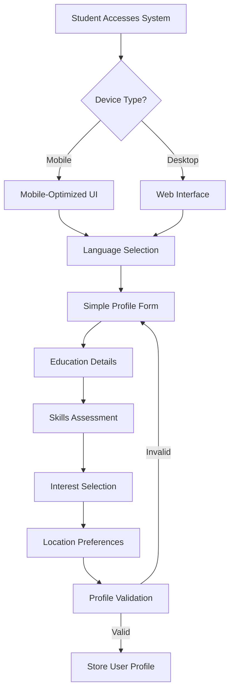
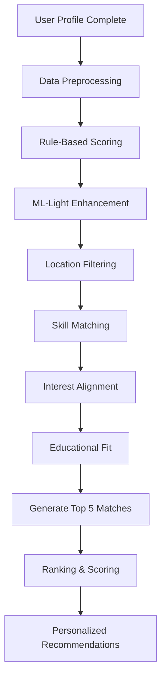
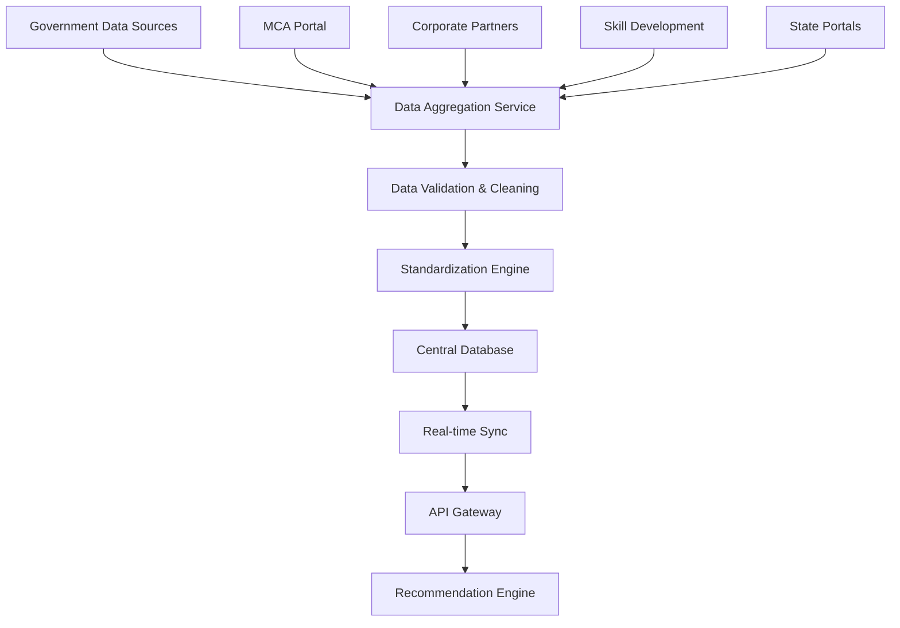
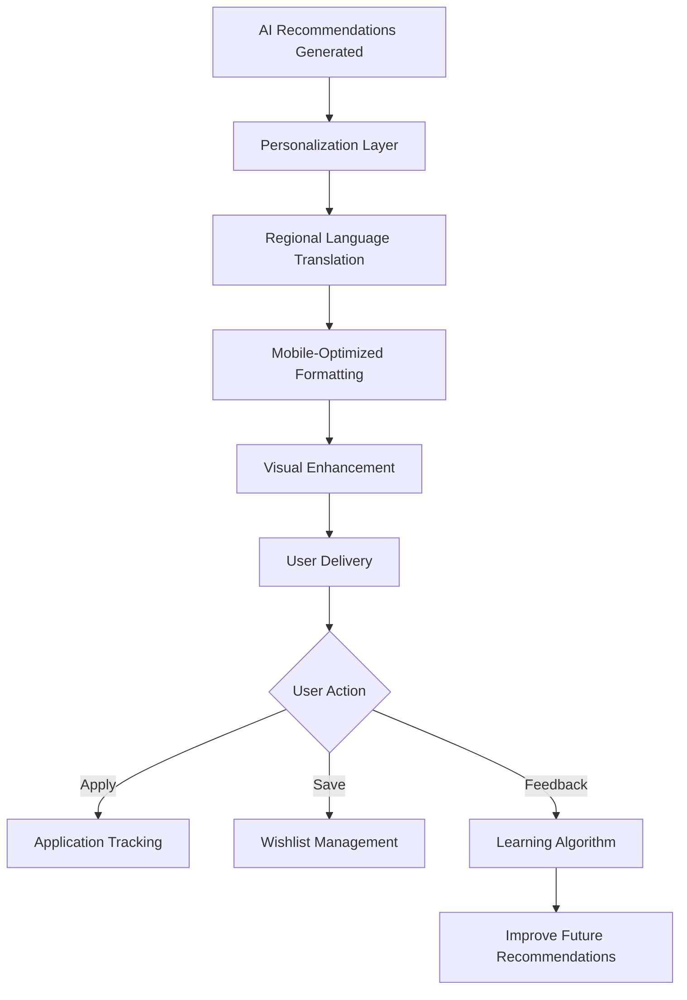

# PROCESS FLOW ARCHITECTURE
## AI-Based Internship Recommendation Engine for PM Internship Scheme
### SIH 2024 - Problem Statement ID: 25034

---

## 🏗️ **SYSTEM ARCHITECTURE OVERVIEW**

```
┌─────────────────────────────────────────────────────────────────────────────┐
│                    PM INTERNSHIP RECOMMENDATION SYSTEM                      │
│                         Ministry of Corporate Affairs                        │
└─────────────────────────────────────────────────────────────────────────────┘

┌─────────────────┐    ┌─────────────────┐    ┌─────────────────┐    ┌─────────────────┐
│   USER LAYER    │    │  PROCESSING     │    │  AI ENGINE      │    │   DATA LAYER    │
│                 │    │     LAYER       │    │                 │    │                 │
│ • Mobile App    │◄──►│ • API Gateway   │◄──►│ • Rule Engine   │◄──►│ • Internship DB │
│ • Web Portal    │    │ • Auth Service  │    │ • ML-Light      │    │ • User Profiles │
│ • Regional UI   │    │ • Validation    │    │ • Scoring Algo  │    │ • Gov Data Sync │
└─────────────────┘    └─────────────────┘    └─────────────────┘    └─────────────────┘
```

---

## 🔄 **DETAILED PROCESS FLOW**

### **PHASE 1: USER ONBOARDING & DATA COLLECTION**



#### **1.1 User Interface Layer**
- **Mobile-First Design**: Primary access for rural/tribal users
- **Regional Language Support**: Hindi, English + local languages
- **Low Digital Literacy UI**: Visual cues, minimal text, large buttons
- **Offline Capability**: Basic functionality without internet

#### **1.2 Data Collection Points**
```typescript
interface UserProfile {
  // Basic Information
  name: string;
  age: number;
  languagePreference: 'en' | 'hi' | string;
  
  // Education Background
  education: 'highschool' | 'diploma' | 'undergraduate' | 'graduate';
  fieldOfStudy: string;
  institutionType: 'rural' | 'urban' | 'tribal';
  
  // Skills & Interests
  skills: string[];
  interests: string[];
  careerAspirations: string[];
  
  // Location & Mobility
  location: {
    state: string;
    city: string;
    district: string;
    pincode?: string;
  };
  mobilityRadius: number; // km willing to travel
  openToRemote: boolean;
  
  // Background Context
  firstGeneration: boolean;
  digitalLiteracy: 'low' | 'medium' | 'high';
  previousInternship: boolean;
}
```

---

### **PHASE 2: AI PROCESSING & RECOMMENDATION ENGINE**



#### **2.1 AI Engine Architecture**
```typescript
class SIHRecommendationEngine {
  // Rule-Based Core (Primary)
  async generateRecommendations(profile: UserProfile): Promise<Recommendation[]> {
    const internships = await this.getAvailableInternships();
    
    // Step 1: Apply hard filters
    const filtered = this.applyFilters(internships, profile);
    
    // Step 2: Calculate compatibility scores
    const scored = filtered.map(internship => ({
      ...internship,
      score: this.calculateCompatibilityScore(profile, internship),
      reasons: this.generateReasons(profile, internship)
    }));
    
    // Step 3: Rank and return top 5
    return scored
      .sort((a, b) => b.score - a.score)
      .slice(0, 5);
  }
  
  private calculateCompatibilityScore(profile: UserProfile, internship: Internship): number {
    let score = 0;
    
    // Interest Match (40% weight)
    if (profile.interests.some(interest => 
      internship.sectors.includes(interest))) {
      score += 40;
    }
    
    // Skill Alignment (30% weight)
    const skillMatch = profile.skills.filter(skill => 
      internship.requiredSkills.includes(skill)).length;
    score += (skillMatch / internship.requiredSkills.length) * 30;
    
    // Location Preference (20% weight)
    if (this.isLocationCompatible(profile.location, internship.location)) {
      score += 20;
    }
    
    // Education Level (10% weight)
    if (profile.education === internship.educationRequirement) {
      score += 10;
    }
    
    // Special considerations for first-generation learners
    if (profile.firstGeneration && internship.supportProgram) {
      score += 15; // Bonus for mentorship programs
    }
    
    return Math.min(score, 100);
  }
}
```

#### **2.2 ML-Light Enhancement**
```typescript
class MLLightEnhancer {
  // Simple collaborative filtering
  async enhanceRecommendations(
    baseRecommendations: Recommendation[],
    profile: UserProfile
  ): Promise<Recommendation[]> {
    
    // Find similar users
    const similarUsers = await this.findSimilarProfiles(profile);
    
    // Boost recommendations based on similar user success
    return baseRecommendations.map(rec => ({
      ...rec,
      score: rec.score + this.calculateSimilarityBoost(rec, similarUsers)
    }));
  }
}
```

---

### **PHASE 3: DATA INTEGRATION & SYNCHRONIZATION**



#### **3.1 Data Sources Integration**
```typescript
interface DataSources {
  primary: {
    mcaPortal: 'https://mca.gov.in/internships';
    pmSchemePortal: 'https://pminternship.gov.in';
  };
  
  secondary: {
    corporatePartners: string[];
    statePortals: string[];
    skillDevelopment: string[];
  };
  
  realTimeSync: {
    frequency: '6 hours';
    fallbackData: boolean;
    cacheStrategy: 'redis';
  };
}

class GovernmentDataSync {
  async syncInternshipData(): Promise<void> {
    // Multi-source data aggregation
    const sources = [
      this.fetchMCAData(),
      this.fetchCorporateData(),
      this.fetchStateData()
    ];
    
    const results = await Promise.allSettled(sources);
    const cleanData = await this.validateAndClean(results);
    
    await this.updateDatabase(cleanData);
    await this.notifyRecommendationEngine();
  }
}
```

---

### **PHASE 4: RECOMMENDATION DELIVERY & USER INTERACTION**



#### **4.1 Recommendation Presentation**
```typescript
interface RecommendationCard {
  internship: {
    title: string;
    company: string;
    location: string;
    duration: string;
    stipend: number;
    logo: string;
  };
  
  matchReason: {
    primaryReason: string;
    skillsMatched: string[];
    compatibilityScore: number;
    whyRecommended: string;
  };
  
  visualCues: {
    difficultyLevel: 'beginner' | 'intermediate' | 'advanced';
    supportAvailable: boolean;
    remoteOption: boolean;
    urgency: 'high' | 'medium' | 'low';
  };
  
  actionButtons: {
    apply: string;
    learnMore: string;
    saveForLater: string;
  };
}
```

---

## 🔧 **TECHNICAL ARCHITECTURE**

### **System Components**

#### **Frontend Layer**
```typescript
// Mobile-First Progressive Web App
const frontendStack = {
  framework: 'Next.js 14',
  ui: 'Chakra UI v3',
  pwa: 'Service Workers + Offline Support',
  languages: 'i18n with regional support',
  accessibility: 'WCAG 2.1 AA compliance'
};
```

#### **Backend Services**
```typescript
// Microservices Architecture
const backendServices = {
  apiGateway: 'Next.js API Routes',
  authentication: 'Firebase Auth',
  database: 'PostgreSQL + Redis Cache',
  fileStorage: 'Firebase Storage',
  monitoring: 'Built-in logging'
};
```

#### **AI/ML Pipeline**
```typescript
// Lightweight ML Stack
const aiStack = {
  primary: 'Rule-based recommendation engine',
  enhancement: 'Simple collaborative filtering',
  deployment: 'Serverless functions',
  scalability: 'Auto-scaling based on load'
};
```

---

## 📊 **DATA FLOW DIAGRAM**

```
┌─────────────────┐    ┌─────────────────┐    ┌─────────────────┐
│   USER INPUT    │    │   PROCESSING    │    │     OUTPUT      │
│                 │    │                 │    │                 │
│ Profile Form    │───►│ Validation      │───►│ 5 Recommendations│
│ Skills/Interests│    │ Rule Engine     │    │ Match Reasons   │
│ Location Prefs  │    │ ML Enhancement  │    │ Action Buttons  │
│ Education Level │    │ Ranking Algo    │    │ Visual Cards    │
└─────────────────┘    └─────────────────┘    └─────────────────┘
         │                       │                       │
         │                       │                       │
         ▼                       ▼                       ▼
┌─────────────────┐    ┌─────────────────┐    ┌─────────────────┐
│  DATA STORAGE   │    │  EXTERNAL APIs  │    │ USER FEEDBACK   │
│                 │    │                 │    │                 │
│ User Profiles   │◄───│ Government Data │◄───│ Application     │
│ Internship DB   │    │ Corporate APIs  │    │ Success Rates   │
│ Match History   │    │ Real-time Sync  │    │ User Ratings    │
│ Analytics Data  │    │ Data Validation │    │ Improvement     │
└─────────────────┘    └─────────────────┘    └─────────────────┘
```

---

## 🎯 **SIH SUCCESS METRICS**

### **Technical Metrics**
- **Response Time**: < 2 seconds for recommendations
- **Accuracy**: > 80% user satisfaction with matches
- **Scalability**: Handle 10,000+ concurrent users
- **Availability**: 99.9% uptime

### **User Experience Metrics**
- **Completion Rate**: > 90% profile completion
- **Application Rate**: > 60% apply to recommended internships
- **User Retention**: > 70% return for more recommendations
- **Digital Literacy**: Usable by users with minimal tech experience

### **Government Integration Metrics**
- **Data Freshness**: Internship data updated every 6 hours
- **Integration Ready**: API-first architecture for easy integration
- **Compliance**: Government security and privacy standards
- **Deployment**: Single-click deployment on government infrastructure

---

## 🚀 **IMPLEMENTATION ROADMAP**

### **Phase 1: Core Development (Week 1-2)**
- ✅ User profile system with validation
- ✅ Mobile-first UI with government design
- ✅ Rule-based recommendation engine
- ✅ Basic data integration

### **Phase 2: AI Enhancement (Week 3)**
- 🔄 ML-light collaborative filtering
- 🔄 Advanced scoring algorithms
- 🔄 Real-time data synchronization
- 🔄 Performance optimization

### **Phase 3: Government Integration (Week 4)**
- 📋 API documentation for government
- 📋 Security compliance implementation
- 📋 Deployment architecture
- 📋 Testing with government data

### **Phase 4: SIH Presentation (Week 5)**
- 📋 Demo preparation with real data
- 📋 Performance benchmarking
- 📋 User testing with target audience
- 📋 Final presentation materials

---

## 🏆 **COMPETITIVE ADVANTAGES**

1. **First-Generation Learner Focus**: Specifically designed for users with limited digital exposure
2. **Government-Ready Architecture**: Built for seamless integration with existing portals
3. **Mobile-First Approach**: Optimized for the primary access method of target users
4. **Lightweight AI**: Rule-based system that's fast, explainable, and resource-efficient
5. **Real Government Data**: Integration with actual PM Internship Scheme data sources
6. **Regional Language Support**: Truly accessible across India's diverse linguistic landscape

---

*This architecture ensures our solution perfectly aligns with SIH Problem Statement 25034 while delivering a production-ready system for the Ministry of Corporate Affairs.*
